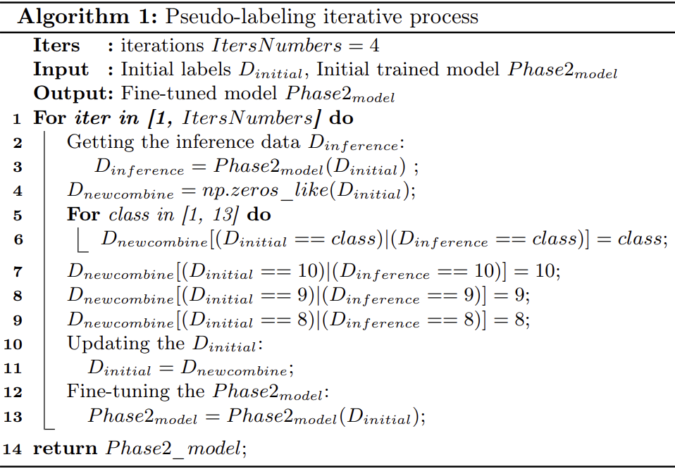

This repository is the official implementation of our participation in [FLARE competition](https://www.codabench.org/competitions/2320/). Experiments on the MICCAI FLARE 2024 TASK2 challenge leaderboard validate promising performance achieving high segmentation accuracy with average Dice similarity coefficients and  Normalized Surface Dice (NSD) of 90.02 % and 95.51 % for multi-organs segmentation respectively. Additionally, efficient inference is
exhibited with an average runtime of 27 seconds per 512 × 512 × 597 3D volume with less than 8G CPU limit of memory consumption.
See our [paper](https://openreview.net/pdf?id=zn9MuMqaK2) in reference section for more details. 


## Methods

This work is a further continuation of the research conducted by last year from [hanglok team](https://openreview.net/pdf?id=Mz7HMmc01M). Our approach is based on the classic two-phase (location-segmentation) cascaded processing stream wherein a lightweight CNN in phase one employing partial convolution and a novel hybrid CNN-Transformer model with synergistic amalgamation of scale-aware modulator and self-attention in phase two are proposed.
 <div align=center>

</div>

- Network architecture details
  - This work is a continuation of last [year's research](https://openreview.net/pdf?id=Mz7HMmc01M), with the primary distinction being the modifications made to the decoder in the second phase( where asymmetric convolutions and group
convolutions are utilized to create a Lightweight Attention-based Convolutional
Block (LACB)) and the image preprocessing process.
  - For the number of parameters，Phase one is 1.36M and Phase two is 9.37M.
  

- Evaluation metrics
  - Dice Similarity Coefficient (DSC) and Normalized Surface Dice (NSD)
  


## Environments and Requirements

- Ubuntu 20.04/Ubuntu 22.04
- CPU:Intel(R) Xeon(R) Platinum 8358 CPU @ 2.60GHz, RAM: 1.0 Ti; 3200 MT/S, GPU: NVIDIA A800 80G
- CUDA 11.6
- python 3.8.15
- monai 1.2.0

To install requirements:

```setup
pip install -r requirements.txt
```

## Dataset and process
### How to get this dataset
This data was obtained by the official competition organizers. If you wish to access it, you may join the competition community and contact MICCAI.FLARE@aliyun.com.

### Preprocess

As the proposed method employs a two-stage architecture, the preprocessing steps for different phases are adjusted accordingly during training.
#### Phase one
- ScaleIntensityRangePercentilesd
- Resized
- NormalizeIntensityd
#### Phase Two
- ScaleIntensityRangePercentilesd
- CropForegroundd
- Spacingd
- NormalizeIntensityd

### Pseudo-label optimization
Due to the organ discontinuity present in the pseudo-labels provided by the dataset(For detailed information, refer to the [paper](https://openreview.net/pdf?id=zn9MuMqaK2)), using such labels for training would limit the model's accuracy improvement. To address this issue, we took into account the spatial structure between organs and further optimized the pseudo-labels.

<div align=center>

</div>


## How to use this code

### Train the Data
Training files can be found in  folder "Flare2024_Train". Change custom transforms stream in  "monai_datamodule.py". Remember to specify phase number before training. 
Run in terminal: 
```
cd Flare2024_Train
python train.py
```

### Inference On CPU
Inferencing files can be found in  folder "flare2023_inference". To execute inference on a GPU, please modify certain sections of the code in ./FLARE2024_Infer/inference.py. Run in terminal: 
```
cd Flare2024_Infer
python inference.py
```
